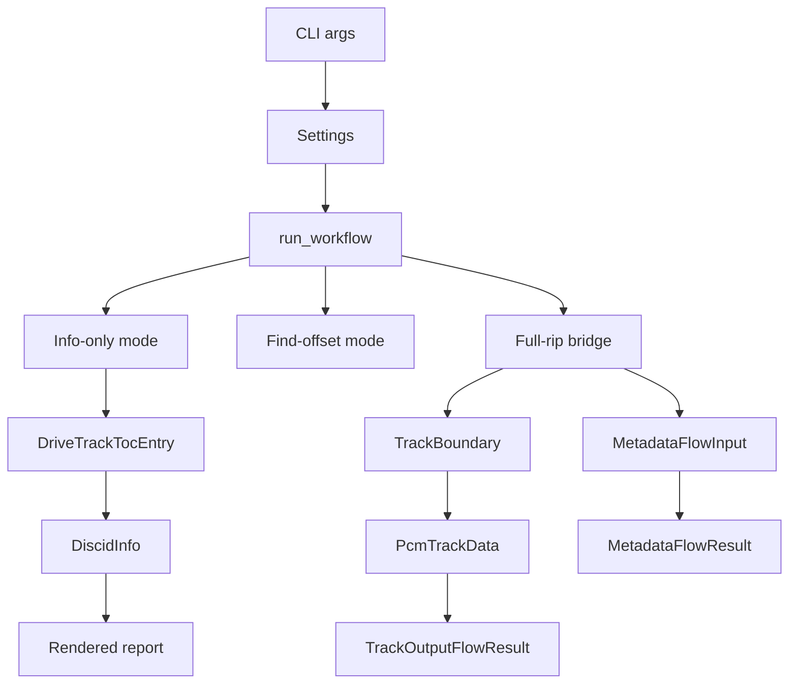

# Architecture: `cyanrip_ctx` Replacement Map

Last updated: 2026-08-22

## Purpose

This document explains how the Rust codebase replaces the upstream C monolithic runtime context (`cyanrip_ctx`) with explicit, smaller structures and typed flow boundaries.

The intent is not to mirror C memory layout. The intent is to preserve behavior while using Rust ownership and module boundaries to reduce hidden coupling.

## Design Summary

Instead of one global context object shared by most code paths, Rust uses:

1. A stable configuration model (`Settings`) created at CLI parse time.
2. Mode-level workflow dispatch (`run_workflow`) using immutable `Settings` input.
3. Narrow flow-specific structs for metadata, TOC/disc identity, and track output.
4. Feature-gated physical-drive structs/functions only where hardware access is required.

This keeps state local to each phase and makes compile-time feature gating easier.

## Responsibility Mapping

### 1) Global runtime options and toggles

C role in `cyanrip_ctx`:
- Device path, offsets, retries, paranoia level, mode flags, output options, metadata toggles.

Rust replacement:
- `Settings` in [src/lib.rs](../src/lib.rs).
- Created from CLI in [src/cli.rs](../src/cli.rs), then passed into [src/app.rs](../src/app.rs) workflow functions.

Why this replaces context safely:
- `Settings` is the single source of truth for user intent.
- The struct is cloned where needed and otherwise passed by shared reference, avoiding a large mutable global state object.

### 2) Mode selection and lifecycle branching

C role in `cyanrip_ctx`:
- Top-level run mode and side-effect flags are read globally.

Rust replacement:
- `run_workflow(settings: &Settings)` in [src/app.rs](../src/app.rs).
- Explicit branches for `find-drive-offset`, `info-only`, `cue-only`, synthetic mode, and full-rip bridge.

Why this replaces context safely:
- Branching is centralized; each branch receives only what it needs.
- No hidden mode mutation from deep functions.

### 3) TOC and drive hardware state

C role in `cyanrip_ctx`:
- Drive identity fields and TOC-derived track boundaries stored centrally.

Rust replacement:
- `DriveTrackTocEntry` and `DriveHwInfo` in [src/cdda/linux_drive.rs](../src/cdda/linux_drive.rs).
- `read_drive_toc_tracks` and `read_drive_hwinfo` expose typed snapshots.
- `InfoTocEntry` in [src/app.rs](../src/app.rs) adapts TOC shape for `-I` report rendering.

Why this replaces context safely:
- TOC/hardware data is computed on demand and passed forward as immutable vectors.
- No persistent mutable global buffer is required for report generation.

### 4) Disc identity (DiscID/CDDB) and track topology

C role in `cyanrip_ctx`:
- Track list and derived disc identifiers shared with metadata and verification flows.

Rust replacement:
- `DiscTrack`, `DiscidInfo` in [src/metadata/discid.rs](../src/metadata/discid.rs).
- `compute_discid(&[DiscTrack])` returns explicit result/error values.

Why this replaces context safely:
- Identity derivation is pure and deterministic from input track topology.
- Consumers do not depend on implicit side effects in a global context.

### 5) Metadata orchestration state

C role in `cyanrip_ctx`:
- Multi-step metadata data (MusicBrainz, cover art, AccurateRip, warnings) accumulated in one object.

Rust replacement:
- `MetadataFlowInput`, `MetadataFlowResult`, `AppTrack` in [src/app.rs](../src/app.rs).
- `orchestrate_metadata_flow` coordinates lookups through traits (`MusicBrainzLookup`, `CoverArtLookup`, `AccuRipLookup`).
- Service result models in [src/metadata/musicbrainz.rs](../src/metadata/musicbrainz.rs) and [src/metadata/accurip.rs](../src/metadata/accurip.rs).

Why this replaces context safely:
- Input and output are explicit typed contracts.
- Lookup dependencies are trait-based, which makes test doubles straightforward.

### 6) Per-track output production state

C role in `cyanrip_ctx`:
- Track-local metadata, PCM data, output format decisions, and generated file paths.

Rust replacement:
- `TrackOutputInput`, `TrackOutputFlowInput`, `TrackOutputFlowResult`, `TrackOutputFile`, `TrackOutputFlowError` in [src/app.rs](../src/app.rs).
- PCM model in [src/audio/mod.rs](../src/audio/mod.rs) (`PcmTrackData`, `PcmSpec`).

Why this replaces context safely:
- Track write pipeline has a clear boundary and return type.
- Errors are typed by stage (naming/io/tagging/encoding) instead of generic context flags.

### 7) Physical reader/paranoia runtime state

C role in `cyanrip_ctx`:
- Reader handles, retry state, media-change checks, and paranoia callback behavior.

Rust replacement:
- Backend abstraction and reader handle ownership in [src/cdda/linux_drive.rs](../src/cdda/linux_drive.rs).
- Retry/paranoia state types in [src/cdda/paranoia.rs](../src/cdda/paranoia.rs) and [src/cdda/reader.rs](../src/cdda/reader.rs).

Why this replaces context safely:
- Handle ownership is tied to struct lifetime (`Drop` cleanup).
- Retry state is explicit input/output to paranoia runner functions.

## Data Flow Snapshot

## Why no monolithic context in Rust

1. Borrowing ergonomics: a single `&mut` context used everywhere quickly creates borrow conflicts.
2. Feature isolation: `cfg`-gated hardware fields/functions stay localized instead of conditional fields in one mega-struct.
3. Testability: each flow can be tested with focused input structs instead of building a full runtime context fixture.
4. Failure clarity: typed flow errors and return objects replace stateful error flags.

## Practical Equivalence Rule

Parity is measured by behavior/output, not by reproducing C struct topology.

If future work needs a session object for ergonomics, it should be a thin container around existing typed flows (not a new mutable dumping-ground equivalent of `cyanrip_ctx`).