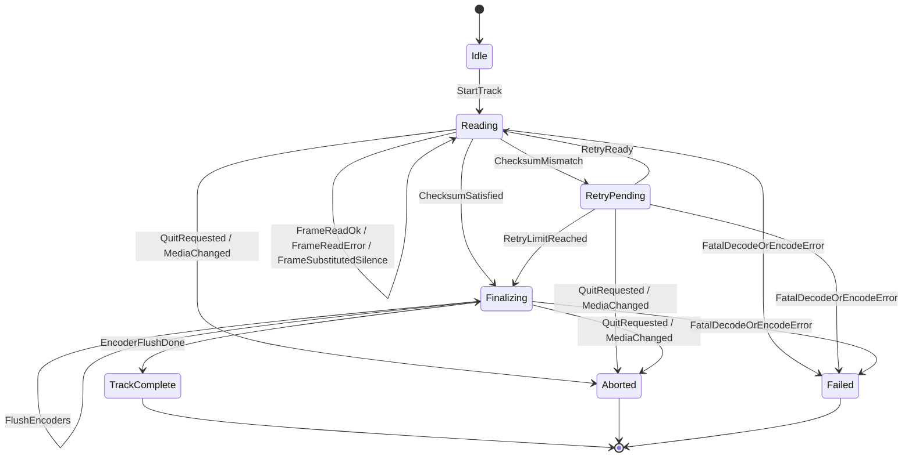

# CDDA Paranoia Rip State Machine

This document captures the parity-oriented state machine for paranoia-mode ripping.
It is derived from src/cyanrip_main.c, especially:

- status callback accounting in status_cb + cyanrip_read_frame
- repeat-rip loop in cyanrip_rip_track
- media-change and quit abort checks in cyanrip_rip_track and main track loops
- flush/finalize sequence in cyanrip_rip_track

Frame reads for the physical-drive backend are performed by the real libcdio
`cdio_paranoia_*` engine (see `NativeParanoiaFrameReader` in src/cdda/linux_drive.rs),
not a raw sector read. The frames it returns are already jitter/error-corrected and
are used directly as the final PCM source -- there is no separate "precheck then
raw reread" step. The RipState/RipEvent machine below models cyanrip's outer
repeat-rip loop (`-r`/`--retries`), which re-runs the (already paranoia-corrected)
per-track read and compares whole-track checksums across passes.

## Goal

Provide one deterministic control-path model that both image-backed and physical-drive backends can use.
This separates policy from transport so reliability behavior is testable in CI.

## Rust Location

- State machine and retry policy: src/cdda/paranoia.rs
- Reader loop and callback counters: src/cdda/reader.rs
- Real libcdio paranoia engine (`cdio_paranoia_init`/`_modeset`/`_seek`/`_read_limited`):
	src/cdda/linux_drive.rs (`NativeParanoiaFrameReader`)
- Full-rip integration: src/app.rs (`acquire_track_pcm_from_physical_reader`)

Paranoia level mapping note:

- level 3 maps to FullXorNeverSkip (upstream intent: FULL xor NEVERSKIP)

## States

- Idle: no active track processing
- Reading: frame read/checksum/decode loop is running
- RetryPending: checksum did not reach required match count; another pass is planned
- Finalizing: flush encoders and finalize track metadata/checksums
- TrackComplete: track finished successfully
- Aborted: rip canceled due to quit request or media change
- Failed: unrecoverable decode/encode pipeline error

## Events

- StartTrack
- FrameReadOk
- FrameReadError
- FrameSubstitutedSilence
- ChecksumMismatch
- RetryReady
- RetryLimitReached
- ChecksumSatisfied
- FlushEncoders
- EncoderFlushDone
- QuitRequested
- MediaChanged
- FatalDecodeOrEncodeError

## Transition Summary

- Idle + StartTrack -> Reading
- Reading + FrameReadOk/FrameReadError -> Reading
- Reading + FrameSubstitutedSilence -> Reading
- Reading + ChecksumMismatch -> RetryPending
- RetryPending + RetryReady -> Reading
- RetryPending + RetryLimitReached -> Finalizing
- Reading + ChecksumSatisfied -> Finalizing
- Finalizing + EncoderFlushDone -> TrackComplete
- Any active state + QuitRequested/MediaChanged -> Aborted
- Any active state + FatalDecodeOrEncodeError -> Failed

Matching upstream `cyanrip_read_frame`, exhausting a frame's retry budget
(`-r`/`--retries`) does not fail the track: a silent frame is substituted and the
per-frame loop continues (`FrameSubstitutedSilence`, Reading -> Reading).
`FatalDecodeOrEncodeError` is now reserved for pipeline-level failures (seek
errors, encoder errors), not single unrecoverable frame reads.

Between the frame read (real or silence-substituted) and checksum/encode
accumulation, upstream applies offset/overread edge-byte trimming
(`cyanrip_read_frame`). The Rust loop keeps a pass-through seam at the same
position (`apply_offset_edge_trim` in src/cdda/reader.rs); actual boundary
trimming is computed by the caller before the read starts
(`apply_offset_frame_adjustment` in src/app.rs).

## Retry Policy (Parity Notes)

The retry policy mirrors upstream semantics used by repeated-rip mode:

- required_matches = ripping_retries
- total attempts capped by max_retries
- checksum match count is computed against prior attempts
- if next pass is potentially final, start encode path for that attempt

This behavior is modeled by RetryPolicy::on_checksum in src/cdda/paranoia.rs.

## Native Paranoia Engine Integration

When built with `backend-libcdio-sys`, `run_paranoia_on_linux_drive_with_defaults_for_level`
routes through `NativeParanoiaFrameReader`, which opens the drive via
`cdio_cddap_identify`/`cdio_cddap_open`, initializes `cdio_paranoia_init`, sets the
mode with `cdio_paranoia_modeset` (mapped from `ParanoiaMode`), and reads each frame
with `cdio_paranoia_read_limited`. Real per-sector callback events (`PARANOIA_CB_*`)
are captured via a thread-local (libcdio's callback carries no user-data pointer) and
merged into `ParanoiaCallbackCounters` after every frame.

Outcome policy in `acquire_track_pcm_from_physical_reader`:

- Any end state other than `TrackComplete` is treated as non-converged.
- `TrackComplete` with `RetryLimitReached` is also treated as non-converged.
- The run's `final_frames` (already paranoia-corrected) are always used as the final
	PCM source when present, regardless of convergence -- there is no raw reread.
- If no finalized frame set exists (for example abort/interrupt before a complete
	pass), the track read fails hard.

Without `backend-libcdio-sys`, the same entry point falls back to the older
software-only heuristic loop (whole-track re-read + checksum comparison), which
remains available for image-backed fault-injection tests.

## Track-Level AccurateRip Mismatch Retry (Local)

After acquiring PCM for a track, full-rip flow performs a local AccurateRip v1-style
checksum comparison against available DB entries for that track.

Behavior:

- If confidence resolves to mismatch (-1), the track read is retried.
- Retry count is capped by max_retries (minimum effective cap of 1 attempt).
- If mismatch persists at cap, rip fails hard.

This closes a previous gap where mismatch was reported globally but did not influence
track acquisition retry decisions.

## Real Damaged-Disc Validation (Recommended)

To validate strict exact-rip behavior on real hardware, run against a scratched or
otherwise problematic audio CD track.

Build:

- cargo build --features "backend-libcdio-sys paranoia cdda"

Run (example track 1):

- cargo run --features "backend-libcdio-sys paranoia cdda" -- -d /dev/cdrom -P max -r 3 -Z 1 -l 1 -o flac -s 0 -B ~/rips

What to confirm in output:

- non-convergence warning when the repeat-rip loop can't get matching checksums:
	WARN paranoia read for track X did not fully converge (state ...); using best-effort corrected frames
- strict failure when AccurateRip mismatch persists:
	AccurateRip mismatch persisted on track X after N attempt(s)

Important:

- Do not use -A / --no-accurip for this validation, because it disables AccurateRip checks.
- Prefer a disc known to exist in AccurateRip to exercise real mismatch confidence paths.

## Regression Tests

Current coverage in src/cdda/paranoia.rs:

- paranoia level to mode mapping
- retry threshold completion behavior
- retry-limit stop behavior when checksums do not converge
- happy-path completion through Finalizing -> TrackComplete
- retry transition flow
- media-change and quit abort transitions
- fatal decode/encode failure transition

Additional app-level regression coverage in src/app.rs:

- paranoia_precheck_treats_retry_limit_as_failure
- accurip_pcm_checksum_matches_word_weighted_formula

## Migration Wiring Steps

1. Introduce CDDA frame reader traits that emit state-machine events.
2. Implement image-backed reader for deterministic CI replay and fault injection.
3. Add Linux physical-reader backend and map runtime callbacks into the same events.
4. Add differential regression tests vs cyanrip for selected damaged-disc scenarios.
